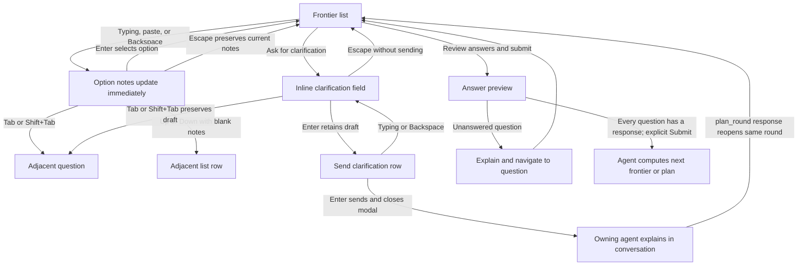
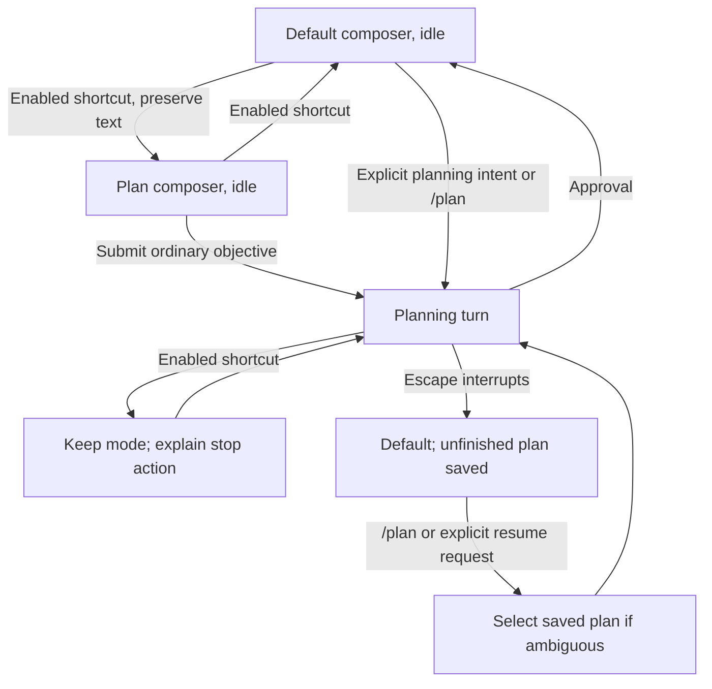

# Planning TUI interactions

This document defines the required TUI behavior and appearance alongside the system requirements in
[SPEC.md](../SPEC.md). Both documents form the package contract and use the same requirement IDs.
Normative interaction rules and scenario outcomes apply together; fenced examples illustrate them.
The modal and annotation workflow is implemented. The [README](../README.md) describes its controls
and pending real-host, SSH, IME, and model-quality verification. Examples are illustrative, not a
wire format.

## Required terminal behavior

### Explicit round submission — REQ-007

The visible review/submission action is labeled `Review answers and submit`, is separated from the
questions by a blank line or divider, identifies unanswered questions, and offers navigation to the
next one. The action uses a bold, accent-colored bracketed label and `›` when focused. It does not
use an option-list dot.

### Options and details — REQ-031

Each question lists its generated options first and `Other (please specify)` last. Alphabetic labels
follow display order and restart at A for each question. A separate `?. Ask for clarification`
action follows Other. The recommendation and reason appear below this list. Other requires nonblank
custom text. Each generated option can have its own optional notes. Editing notes updates that
option's local notes immediately without selecting it or requiring confirmation. Changing focus,
pressing Escape, or selecting another option preserves those notes. Pressing Enter on a generated
option selects it with its current notes. Editing the selected option's notes updates its answer
preview; clearing them removes its notes.

### Modal terminal interaction — REQ-016

Planning input uses a focused modal over the Pi conversation. The frontier is one continuous,
scrollable list of numbered questions, options, and visible actions. Each question exposes its
Markdown context, recommendation and reason, and clarification action. Selection checkmarks show
answers without separate Answered or Unanswered rows. Changed questions retain a visible
reconfirmation warning. Question headings use `❓` in emoji mode and `?` in Unicode mode;
recommendations use `➡️` and `→`, respectively. Blank lines separate question groups. Each question
heading has a divider above it in the theme's accent color; question dividers scroll with the
content and remain visible when hints are hidden. A blank line separates question context and
reconfirmation warnings from the option list. Every option letter and label, including Other and the
`?.` clarification action, is bold before selection. A blank line also separates the
`Review answers and submit` action from the questions. The title is `Plan questions (round N)`. A
blank line separates the modal title from its content. When terminal height cannot fit the gap,
controls, and a content row, the gap is omitted. N starts at 1 and increments for each new logical
frontier; clarification, same-round updates, reopening, and resumption preserve it. Question
numbering remains independent of this count. A selected option's complete rendered text is bold and
begins with a persistent checkmark, including while focused. An unselected focused row uses `🔹` in
emoji mode and `›` in Unicode mode; recommendation arrows are reserved for recommendations.
Unselected unfocused options use a dot. No extra focus marker is required for a selected row.
Display labels do not add letter or question-mark shortcuts.

The following key behavior is required. Extra shortcuts are optional; visible controls expose
required actions without memorizing Ctrl-key combinations.

| Focus                                   | Keys            | Behavior                                                                                                                                                         |
| --------------------------------------- | --------------- | ---------------------------------------------------------------------------------------------------------------------------------------------------------------- |
| Frontier list                           | Up / Down       | Move through options and actions across question boundaries without selecting answers.                                                                           |
| Frontier list                           | Tab / Shift+Tab | Move to the next/previous question, wrap at the ends, and focus its selected option or its first option if unanswered.                                           |
| Generated option                        | Enter           | Select the option and remain on its row.                                                                                                                         |
| Generated option                        | Backspace       | Edit its notes immediately, deleting the preceding character.                                                                                                    |
| Option row                              | Typing / paste  | Focus its inline field and insert the input immediately.                                                                                                         |
| Other                                   | Enter           | Focus its required inline text field.                                                                                                                            |
| Generated-option notes                  | Enter           | Select the option with its current notes and return to its row.                                                                                                  |
| Other text                              | Enter           | Confirm the custom answer and return to its row. Empty Other is rejected.                                                                                        |
| Clarification field                     | Enter           | Retain the text and return to the list without sending it.                                                                                                       |
| Question text field                     | Shift+Enter     | Insert a newline in option notes, Other text, or clarification text.                                                                                             |
| Review-note field                       | Enter           | Insert a newline in the note, never in the plan.                                                                                                                 |
| Question inline field                   | Tab / Shift+Tab | Navigate to the next/previous question without selecting an answer.                                                                                              |
| Other or clarification field            | Tab / Shift+Tab | Preserve drafts and navigate to the next/previous question without selecting or sending.                                                                         |
| Review field                            | Tab / Shift+Tab | Transfer focus among visible controls without submitting.                                                                                                        |
| Visible action                          | Enter           | Activate the focused action; merely focusing it has no effect.                                                                                                   |
| Nested editor, preview, or confirmation | Escape          | Return one level without sending, selecting, or approving; preserve current option notes, unfinished text, confirmed custom answers, and confirmed review notes. |
| Outermost frontier or review            | Escape          | Arm closing and, when hints are shown, display the close reminder. A second consecutive Escape closes with drafts retained; other input disarms closing.         |

An Escape that returns from a nested view does not arm outer dismissal. The next opened modal starts
unarmed. Review has an always-visible action bar; document focus supports arrow navigation and
scrolling, while action-bar focus uses arrows to choose controls. When hints are shown,
context-sensitive help identifies what Enter and Escape will do. The complete plan, including long
blocks, remains readable.

Answer details and clarification text are edited within the question list rather than in a
replacement view. Typing on a generated option appends an editable `[notes: …]` suffix directly to
its rendered text, using the theme accent color. The option row does not add a separate notes
column, label row, or unsubmitted marker. The suffix wraps with the option and retains its color
after editing. Empty or whitespace-only notes are omitted from the list and answer preview. Nonempty
selected-option notes use the same suffix in the preview. As text grows, later rows move; the
cursor, focused option, other drafts, and fixed controls remain available. Other and clarification
text use inline `[answer: …]` and `[question: …]` suffixes with the same wrapping and cursor
behavior. Other uses the option-note accent color; clarification uses the theme's link color. Enter
retains the field text and exits editing; for Other it also selects the nonblank custom answer. The
frontier footer uses one hint line directly below its divider, without a blank row between them.
Editing changes the hints without changing the footer height. F1 toggles all hints and their divider
in question and review views, including the double-Escape reminder. With hints hidden, the first
outer Escape still arms closure and the second closes without displaying a reminder. The toggle
retains drafts and focus, remains usable while hints are hidden, and does not hide action buttons or
errors. Each new modal reads the configured hints default. F1 changes only the current modal and
never changes that saved default. Escape returns from inline editing without arming outer dismissal.

Right arrow does not open a field or activate an action from the frontier list. Generated-option
notes have no separate Confirm action. Enter selects the option and returns to its row;
Tab/Shift+Tab navigate to the next/previous question. When a question's inline field is empty or
whitespace-only, Up/Down return to list navigation and move focus without selecting an answer.
Nonblank notes retain arrow-key cursor editing. The list hint reads
`Typing on an option adds notes`.

During an agent turn, a planning question or review modal replaces Pi's working indicator with
`Awaiting Plan` and a distinct waiting animation. Closing, cancellation, failure, or transfer
restores the normal working indicator without changing a newer wait.

Overflow scrolls within the modal. Narrow terminals can stack content, but cannot lose actions,
question context, focused fields, or draft text. Resize preserves selection and drafts and keeps the
focused control visible. The layout fits terminal display width and preserves Unicode text and
input-method focus. When the terminal distinguishes Shift+Enter, that key inserts question-field
newlines; multiline paste is also supported. Mouse input is not required. The Page Up/Page Down hint
says `scroll`. When content overflows, a right-edge scrollbar shows the visible proportion and
position without scrolling the title or footer. Extremely narrow terminals may omit the scrollbar to
preserve usable content width.

### Read-only plan review — REQ-022

The TUI opens on the latest complete Markdown revision with scrolling and an always-visible action
bar for annotation, overall feedback, feedback review/submission, and approval. The plan cannot be
edited; only user notes accept text. Feedback returns to the owning agent, which revises the plan
and presents it for fresh approval. A new review opens on the latest plan without a diff or
historical annotations overlaid on it.

### Discard confirmation — REQ-023

Review exposes a visible `Discard notes and approve…` action. Activating it opens a confirmation
that identifies the latest pending revision and explains that all its unsent block notes, overall
feedback, and unfinished note text will be discarded. Dismissing the confirmation preserves the
notes and does not approve the plan. Explicit confirmation discards the notes and approves the
unchanged revision under the saving and revision-validation requirements in `SPEC.md`.

### Revision browsing — REQ-033

With document focus, `[` and `]` display the previous and next complete revisions; inside note
fields they are ordinary text. The display identifies the viewed revision and whether it is the
latest. Older revisions are read-only: annotation, feedback submission, and approval apply only to
the latest pending review. Returning to the latest restores its drafts and reading position.
Browsing does not change the pending approval identity, create a revision, replay feedback, or
replace the latest revision with an older one.

### Configuration — REQ-019

`/plan-settings` opens a dedicated menu using Pi's settings interaction. When a setting changes, the
menu displays the new value immediately and persists it without progress or success messages. The
key hints remain unchanged. If persistence fails, the menu restores the previous value and reports
an actionable error. Settings include the approved-plan directory, symbols (Unicode by default,
emoji opt-in), modal border (Rounded by default, Square, Double, ASCII, or None), Show hints by
default (On by default), and the planning shortcut (Shift+Tab by default, optionally disabled). The
shortcut and hints settings use the same personal and trusted-project precedence as other settings.
The personal settings menu identifies trusted project values that mask personal choices and names
their configuration file. After a successful save, shortcut changes apply immediately; the menu
distinguishes the saved shortcut from a shortcut blocked by a host binding. Border choice applies to
the outer question, review, and note-dialog frames. Double uses `╔═╗`, `║`, and `╚═╝`; ASCII uses
`+`, `-`, and `|`. Question and footer dividers use `═` for Double, `-` for ASCII, and `─`
otherwise. Question dividers use the theme's accent color; footer dividers retain the theme's
horizontal-rule style. When hints are shown, None retains the divider. Pi editor decorations remain
host-controlled. Small-terminal fallback preserves accessible content and controls. Appearance
changes preserve drafts and do not change Markdown, decisions, or approval.

### Composer shortcut — REQ-034

The main Pi composer shows Plan or Default mode. With the agent idle, the configured planning
shortcut toggles the mode and preserves typed text. Shift+Tab is the default; users can rebind or
disable the shortcut. While an effective Pi composer binding conflicts with the selected shortcut,
the package preserves Pi's key handling and reports the conflict. Before using Shift+Tab for
planning, users must rebind Pi's default `app.thinking.cycle` action in `keybindings.json` and
reload Pi. The package does not edit Pi's keybindings. After reload, the shortcut uses the effective
bindings without requiring another extension reload. Selecting Plan alone does not send input or
resume work. In Plan mode, the next ordinary user message enters or resumes planning without special
wording or a slash prefix. Commands, shell input, and extension-injected messages retain their
existing routing. During an active turn, the enabled planning shortcut leaves the mode unchanged,
reports that the user must stop the current turn to switch, and does not queue a mode change. An
ordinary message submitted during work keeps the current turn's mode and Pi's delivery policy.
Inside modal fields and controls, Shift+Tab retains REQ-016 navigation.

### Clarification field — REQ-012

With an empty draft, Ask for clarification focuses its inline field. Enter retains the draft and
returns to the list without sending. With nonblank text, the row displays Send clarification; Enter
activates that explicit send action and returns control to the agent. Typing or Backspace edits the
draft. When the round reopens, focus identifies the originating question and makes its response
accessible.

### Inline annotation placement — REQ-032

Users can focus document blocks and write notes directly beside or beneath them while the plan
remains visible.

### Closing planning — REQ-021

Outer double Escape stops the owning agent turn and returns to Default mode.

## Interaction conformance

| Scenario                | Expected outcome                                                                                                                                                                                                                        | Requirements     |
| ----------------------- | --------------------------------------------------------------------------------------------------------------------------------------------------------------------------------------------------------------------------------------- | ---------------- |
| Navigate and submit     | Tab and Shift+Tab preserve unfinished answers; unresolved items block submission and recommendations are not silently accepted.                                                                                                         | REQ-007, REQ-016 |
| Nested modal navigation | Arrows traverse question boundaries; Enter selects without advancing; editors route keys by context; one Escape returns a level, and only consecutive outer Escapes close. Resize preserves drafts and reachable controls.              | REQ-016, REQ-021 |
| Annotate and revise     | Block notes retain exact source/revision context through wrapping and resize. Batch preview exposes what will be sent; submission includes overall feedback and never edits Markdown. The revised plan starts without reassigned notes. | REQ-022, REQ-032 |
| Browse revisions        | Review opens on the latest plan. Bracket navigation displays full older revisions without permitting annotation or approval; returning restores current drafts and position.                                                            | REQ-033, REQ-011 |
| Settings                | Trusted project fields override supplied defaults; invalid settings fail without changing saved data or decisions. New modals use the saved hints default; F1 changes only the current modal.                                           | REQ-019          |

Additional conformance checks for REQ-003, REQ-016, REQ-019, REQ-021, REQ-030, REQ-031, and REQ-034
cover: idle and busy mode toggles; plain-message entry and natural-language resume; branch
restoration; immediate option-note edits, paste, wrapping, selection and Escape; empty-note list
navigation; Other-last ordering and recommendation placement; selected-row styling; round count
recovery; every border and symbol setting; invalid settings and trusted overrides; interruption
without stale continuation.

## Frontier overview

The example uses Unicode symbols with question 3 answered and question 4 focused. REQ-016 and
REQ-031 define its layout and option behavior. A long frontier scrolls, and each focused option
retains visible question context.

The settings menu offers Rounded, Square, Double, ASCII, and None borders, with Rounded as the
default. Unicode symbols are the default; emoji is optional. Selected options use `✓` or `✅`,
question headings use `?` or `❓`, and recommendations use `→` or `➡️`, respectively. Show hints by
default is On. Framed modals have horizontal padding. Below six columns, the frame omits padding.
Below four columns or eight terminal rows, the modal renders without the border. Generated question
headings in the frontier and answer preview use Pi's heading styles without literal hash prefixes.
Ordinary plan Markdown uses Pi's renderer: emphasis becomes terminal styling, and code blocks
preserve literal markup.

When hints are shown, a horizontal divider separates the scrollable body from the fixed footer.
Review-note editors retain their native bottom border. When a divider would displace controls or the
last content row, it is omitted.

```text
Plan questions (round 2)

──────────────────────────────────────────────────────────────────────────
? 3. Primary navigation
  The modal contains several questions.

  ✓ A. Continuous option list with Tab shortcuts
  · B. Switch questions with Tab
  · C. Other (please specify)
  · ?. Ask for clarification
  → Recommendation: A — preserves continuous navigation.

──────────────────────────────────────────────────────────────────────────
? 4. Notes on unselected options
  A user may edit notes on more than one option.

  › A. Submit selected answer and details only [notes: Keep other drafts local]
  · B. Include notes on every option
  · C. Other (please specify)
  · ?. Ask for clarification
  → Recommendation: A — sends only the chosen answer.

  [Review answers and submit]
```

Option letters and labels are bold in the terminal; the selected row's explanation is bold as well.
The review button is bold and uses the theme's accent color. When focused, it displays `›` without
an option dot. A recommendation does not count as an answer.

### Choose, qualify, and revise an answer

Requirements: REQ-007, REQ-016, REQ-030, REQ-031.

| Initial state                                        | User action                                                | Observable outcome                                                                                                        |
| ---------------------------------------------------- | ---------------------------------------------------------- | ------------------------------------------------------------------------------------------------------------------------- |
| Question 3 is answered; question 4 is unanswered.    | Move Down from the last action of question 3.              | Focus enters question 4; question 3's answer is unchanged.                                                                |
| Focus is on a generated option.                      | Type or paste notes, then press Enter.                     | Notes update immediately without selecting; Enter selects the option with its current notes and returns focus to its row. |
| A selected option has notes.                         | Edit the notes and press Escape.                           | The answer preview contains the current notes; Escape returns to the list without reverting edits.                        |
| An unselected option has draft notes.                | Select a different option.                                 | Both options retain their text; only the selected option's current notes enter the submission preview.                    |
| Focus is in generated-option notes.                  | Press Tab or Shift+Tab.                                    | Focus moves to the next or previous question without selecting an answer.                                                 |
| Generated-option notes are empty or whitespace-only. | Press Up or Down.                                          | Focus returns to list navigation and moves to the adjacent row without selecting.                                         |
| Other is focused.                                    | Press Enter, leave its text blank, and attempt to confirm. | The field remains open with a validation message; no answer is selected.                                                  |
| A generated option is selected.                      | Confirm nonblank text under Other.                         | Other replaces the selection; previous option notes remain local drafts.                                                  |
| Focus is in the list.                                | Press Tab or Shift+Tab.                                    | Focus jumps to the adjacent question's selected or first option, wrapping at the ends. No answer changes.                 |
| A later frontier introduces questions.               | Open that frontier.                                        | New numbers continue after earlier questions; an existing question retains its number after clarification or revision.    |

Numbered answers can be composed in any order, as in a manual brainstorming exchange:
`3. A; 4. A — only send the selected option's details`. The outgoing representation expands that
shorthand into unambiguous context:

```text
Question 3 — Primary navigation
Selected: Continuous option list with Tab shortcuts

Question 4 — Notes on unselected options
Selected: Submit selected answer and details only [notes: Only send the selected option's details.]
```

Stable plan/question/option identities accompany these display values. This example illustrates the
displayed letters without prescribing a serialization.

### Clarification and whole-round submission

Requirements: REQ-005, REQ-007, REQ-012, REQ-016, REQ-019, REQ-028.



Generated-option notes form an editable `[notes: …]` suffix directly after the option text. The
suffix uses the theme's accent color and wraps with the option. Typing, paste, and Backspace update
notes immediately without selecting the option. When the option is selected, its current notes also
update the answer preview. Nonblank notes support Up/Down cursor movement between displayed rows.
Empty or whitespace-only notes are omitted, and Up/Down navigate the list. Tab/Shift+Tab navigate
questions from the notes. Right moves the cursor inside a field but does not open a field or
activate an action from the list. Escape returns to the list and preserves edits. Notes retain their
accent color and use the same suffix format in the preview. A blank line separates the bracketed
Review answers and submit button from the questions. The frontier footer has one hint line directly
below its divider; `Typing on an option adds notes` explains direct editing. F1 hides all hints, the
double-Escape reminder, and their divider while retaining errors and action controls. F1 remains
usable when hints are hidden. Each new modal starts with the configured default; toggling hints does
not write settings.

During an agent turn, a question or review modal changes Pi's working indicator to `Awaiting Plan`,
with rotating circle glyphs advancing every 350 ms. Closing, cancellation, failure, or transfer
restores Pi's defaults. Cleanup from an older modal does not replace a newer modal's wait. When Pi
is idle, opening a modal does not add a working indicator.

Other text uses an accent-colored `[answer: …]` suffix; clarification text uses `[question: …]` in
the theme's link color. In question fields, Shift+Enter inserts a newline, Tab/Shift+Tab navigate
questions, and Enter finishes local editing. For Other, Enter also selects the nonblank custom
answer. Empty or whitespace-only fields return to list navigation on Up/Down.

Clarification does not require a complete answer set. Enter retains its draft without sending and
returns to the list. With nonblank text, the row reads `?. Send clarification`; pressing Enter on
that row sends the request and closes the modal. The owning agent explains in the existing
conversation, then calls `plan_round` to reopen the same round and display the response beside its
question, with other drafts preserved. The agent receives the request and the selected answer with
its current option notes, marked as unsubmitted. Unselected option notes, unfinished custom answers,
and unsent clarification text stay local; the full drafts remain available when the modal reopens.

If a question remains blank, Review answers and submit explains what is missing and offers Go to
next unanswered question. A custom answer such as “Defer until we choose deployment” counts as an
explicit response, but does not resolve that decision or authorize dependent choices. Sending a
clarification or submitting answers never means approving a plan.

## Read-only plan review

Requirements: REQ-016, REQ-022, REQ-032, REQ-033.

The document is read-only in every focus context. Overall feedback opens the overall-feedback field;
Annotate opens a field beside or beneath the focused block. Paragraphs, headings, list items, and
code blocks can be targeted without substring selection.

```text
Plan review · revision 4 · latest

  ## Completion behavior
› Print “Timer complete” and sound the terminal bell.
  Your note:
  Also display elapsed time; sound may be muted.

  ## Verification
  Test cancellation and normal completion.

  Annotate | Overall feedback | Review feedback | Approve | Discard notes and approve…
```

During note editing, the full plan remains readable and scrollable. The action bar stays visible in
every review mode, including feedback preview and discard confirmation. Tab and Shift+Tab transfer
focus between the document, open note fields, confirmation/removal controls, and actions. Arrows
move within the active context: document navigation/scrolling, text cursor movement, or action
selection. Enter in a note inserts a newline; it cannot insert text into the plan. Confirming a
block note only stores local feedback.

### Annotate and submit feedback

| Initial state                                       | User action                                                                       | Observable outcome                                                                                        |
| --------------------------------------------------- | --------------------------------------------------------------------------------- | --------------------------------------------------------------------------------------------------------- |
| Latest revision is visible.                         | Focus a block and activate Annotate.                                              | A note field opens beneath the focused block; surrounding plan text remains readable and scrollable.      |
| Note field is focused.                              | Type paragraphs using Enter; then Tab to its confirmation action and activate it. | The note is associated with that exact block and revision and remains unsent.                             |
| Two paragraphs contain identical text.              | Annotate the second paragraph.                                                    | The annotation identifies that occurrence, not whichever text match is found first.                       |
| Confirmed block notes exist.                        | Add overall feedback and open Review feedback.                                    | The preview shows notes with their source excerpts and revision, plus overall feedback.                   |
| An editor contains unfinished, unconfirmed changes. | Open Review feedback.                                                             | The preview identifies the excluded unfinished edits; the user can return to confirm them before sending. |
| Outgoing feedback is nonempty.                      | Activate Send feedback.                                                           | The owning agent receives the batch; reviewed Markdown remains unchanged.                                 |
| The agent returns a revised plan.                   | Review opens.                                                                     | The latest full revision appears without a diff or active annotations copied from the previous revision.  |

### Browse complete revisions

From document focus, `[` and `]` browse the available complete revisions. On an older revision the
title reads `Plan review · revision N · older — read-only`; annotation and approval are unavailable
on it. Returning to the latest restores its draft notes and reading position. Inside a note field,
typing brackets inserts those characters. Browsing never changes which revision is pending approval
or resends earlier feedback.

## Escape, approval, and recovery

Requirements: REQ-011, REQ-016, REQ-020, REQ-021, REQ-023, REQ-024, REQ-027.


The discard confirmation names the pending revision and includes block notes, overall feedback, and
unfinished note text. Cancelling the confirmation preserves all notes. Confirming approves the
unchanged plan; notes are not edits to apply during saving. After a failed save, approval requires
explicit retry or cancellation under REQ-023.

When acceptance saving fails after the Markdown file was created, tree navigation preserves the
recorded approval attempt. Explicit retry reconciles the same revision, content, destination, and
approval time, including after a directory setting changes. Navigation alone does not allocate a new
plan identity. Before saving a new artifact from a divergent continuation, including a sibling
branch within the same Pi session, the continuation receives a distinct identity.

Escape returns from a field, preview, or confirmation without submitting. From the outermost list or
review, the first Escape arms closing. When hints are shown, it displays “Press Esc again to close;
drafts retained.” A second consecutive Escape closes planning; any other input disarms closing.
Returning from an editor does not count as the first outer Escape. A newly opened modal starts
without an armed closing prompt.

Closing stops the pending interaction and owning agent turn, returns to Default, preserves saved
unfinished work, and requires explicit resume. It does not submit answers or feedback, approve a
plan, or trigger implementation. Storage failures remain visible; retained memory is not presented
as saved state. Session replacement invalidates old callbacks and pending confirmations.

## Composer mode, entry, and settings

Requirements: REQ-003, REQ-019, REQ-020, REQ-021, REQ-034.

Before using the default Shift+Tab planning shortcut, rebind Pi's `app.thinking.cycle` in its agent
directory's `keybindings.json` and run `/reload`. The default path is
`~/.pi/agent/keybindings.json`; `PI_CODING_AGENT_DIR` changes the directory, and conflict warnings
name the actual path. Until the conflict clears, Shift+Tab retains its Pi action and Plan reports
the required correction. `/plan` remains available. In `/plan-settings`, choose another shortcut or
disable it. The menu shows any trusted project override and any host binding that blocks the
selected shortcut. After a successful save, shortcut changes apply immediately.



Selecting Plan alone does not send composer text or open a saved interaction. While work is running,
mode switching is rejected rather than deferred. Inside modals, Shift+Tab navigates their fields and
questions. Ordinary queued messages retain Pi's delivery policy and the running turn's mode. Default
conversation does not silently restart paused work. Native Escape can dismiss autocomplete without
interrupting the turn. After Pi finishes automatic recovery for an interrupted or failed planning
turn, Plan returns to Default.

Natural-language examples include “enter plan mode,” “help me plan this change,” “resume the plan,”
and “continue planning.” A feature question such as “what does plan mode do?” is not an entry
request. These are examples of intent, not keyword matching rules. The agent asks the user to select
a plan when a reference is ambiguous.

`/plan` restores the current unfinished plan or lists saved plans on this branch for selection.
`/plan-settings` selects personal defaults or trusted project overrides and shows the approved-plan
directory, symbols, border style, Show hints by default, and Planning shortcut. When a trusted
project value masks a personal setting, the personal menu names that value and its configuration
file. Updating appearance does not submit drafts. Unicode and Rounded are defaults; Double uses
double-line frames and dividers, ASCII uses ASCII frame characters and dividers, and None retains
the divider when hints are shown, without an outer frame. Pi's editor lines retain native styling.
When a planning interaction next opens, it uses the updated appearance settings and preserves its
drafts. The settings menu displays each change immediately and saves without progress or success
messages. Key hints remain unchanged. A failed write restores the previous setting and reports the
error; Escape closes the menu.

Show hints by default uses the same personal/trusted-project precedence as the other settings. Set
it to Off and open a modal: hints and their divider are hidden, while errors and action controls
remain visible. Press F1 to show hints for that modal, then reopen it: the saved Off default applies
again. The first outer Escape arms closing even when the reminder is hidden.

## Terminal and integration scenarios

Requirements: REQ-001, REQ-011, REQ-014, REQ-016, REQ-020, REQ-027, REQ-029.

| Situation                                                    | Observable outcome                                                                                                                      |
| ------------------------------------------------------------ | --------------------------------------------------------------------------------------------------------------------------------------- |
| Frontier or plan exceeds terminal height.                    | Content scrolls with a proportional right-edge scrollbar; title and footer stay fixed. Actions and every content line remain reachable. |
| Terminal narrows or resizes while a note is open.            | Content adapts, actions remain visible, and focus, target identity, text, and confirmed selections survive.                             |
| Unicode, wide characters, or an input method is used.        | Text is preserved, lines fit display width, and the active field receives cursor/input focus.                                           |
| Terminal cannot distinguish Shift+Enter.                     | Use multiline paste for question-field newlines. Review-note fields retain plain Enter for newlines.                                    |
| Optional presenter returns input for an old revision.        | Validation rejects it without changing current answers, note targets, or approval.                                                      |
| Terminal is selected or the presenter selector is cancelled. | The TUI reopens with drafts preserved and the saved hints default.                                                                      |
| An active presenter fails or unregisters.                    | The TUI restores the pending interaction with drafts preserved. Cancellation closes without reopening.                                  |
| Persistence fails or a session is restored.                  | The UI reports the save state and restores only the applicable saved branch; it does not infer submission or replay approval.           |

These scenarios define checks to perform during implementation. They are not records of executed
tests or proof that the current interface implements them.
