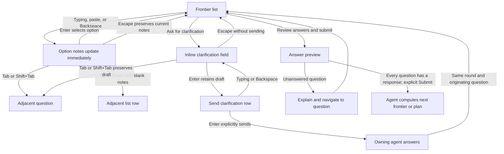
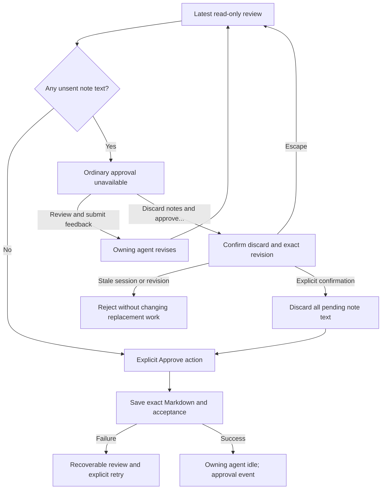
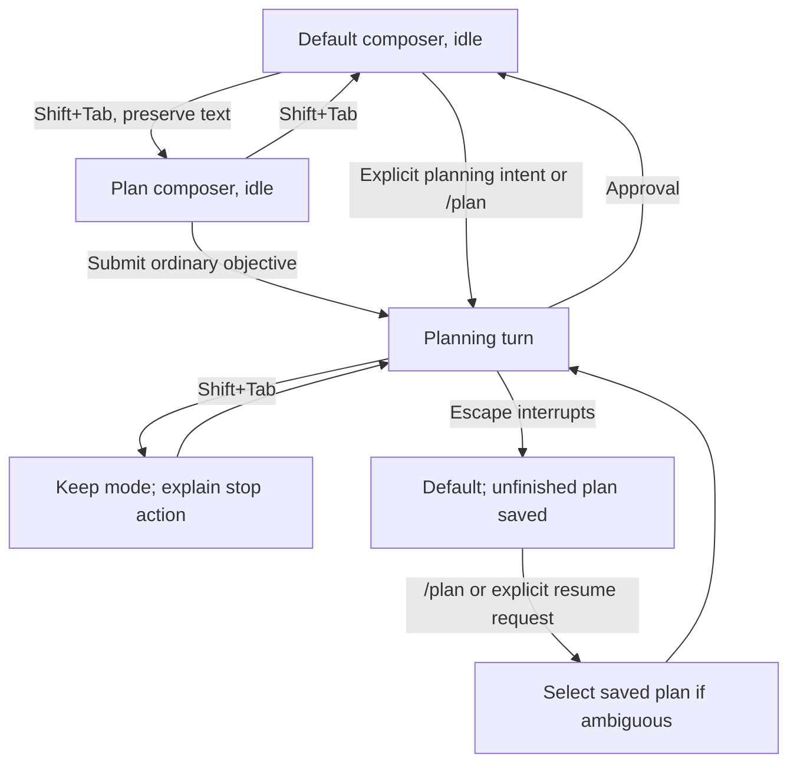

# Planning TUI interactions

These walkthroughs illustrate the required behavior in [SPEC.md](../SPEC.md). Requirement IDs refer
to that specification, which remains the contract. The modal and annotation workflow is implemented.
The [README](../README.md) describes its controls and pending real-host, SSH, IME, and model-quality
verification. Examples are illustrative, not a wire format.

## Frontier overview

The modal presents questions and options as one continuous list. A long frontier scrolls, and each
focused option retains visible question context. The marker for an unselected focused row is `›` in
Unicode mode or `🔹` in emoji mode. A selected row remains bold and checkmarked, including while
focused. The title is `Plan questions (round N)`; same-round clarification and resume preserve N,
and new frontiers increment it. The title has a blank line beneath it unless the terminal is too
short to retain the gap, controls, and a content row. Checkmarks identify selected answers; Answered
and Unanswered status rows are omitted. Changed questions retain their reconfirmation warning.

The settings menu offers Rounded, Square, Double, ASCII, and None borders, with Rounded as the
default. Unicode symbols are the default; emoji is optional. Selected options use `✓` or `✅`,
question headings use `?` or `❓`, and recommendations use `→` or `➡️`, respectively. Show hints by
default is On. Framed modals have horizontal padding. Below six columns, the frame omits padding.
Below four columns or eight terminal rows, the modal renders without the border. Generated question
headings in the frontier and answer preview use Pi's heading styles without literal hash prefixes.
Ordinary plan Markdown uses Pi's renderer: emphasis becomes terminal styling, and code blocks
preserve literal markup.

Each question starts generated-option letters at A and lists Other last. The
`?. Ask for clarification` action follows Other, then the recommendation and reason. Blank lines
separate question groups. Letters are display labels; typing on an option begins its inline field
rather than selecting an option by letter.

When hints are shown, a horizontal divider separates the scrollable body from the fixed footer.
Review-note editors retain their native bottom border. When a divider would displace controls or the
last content row, it is omitted.

```text
? 3. Primary navigation
  ✓ A. Continuous option list with Tab shortcuts
  · B. Switch questions with Tab
  · C. Other (please specify)
  · ?. Ask for clarification
  → Recommendation: A — preserves continuous navigation.

? 4. Notes on unselected options
  › A. Submit selected answer and details only [notes: Keep other drafts local]
  · B. Include notes on every option
  · C. Other (please specify)
  · ?. Ask for clarification
  → Recommendation: A — sends only the chosen answer.

  [Review answers and submit]
```

The selected row is bold in the terminal. The review button is bold and uses the theme's accent
color. When focused, it displays `›` without an option dot. A recommendation does not count as an
answer.

### Choose, qualify, and revise an answer

Requirements: REQ-007, REQ-016, REQ-030, REQ-031.

| Initial state                                        | User action                                                | Observable outcome                                                                                                        |
| ---------------------------------------------------- | ---------------------------------------------------------- | ------------------------------------------------------------------------------------------------------------------------- |
| Question 3 is answered; question 4 is unanswered.    | Move Down from the last action of question 3.              | Focus enters question 4; question 3's answer is unchanged.                                                                |
| Focus is on a generated option.                      | Type or paste notes, then press Enter.                     | Notes update immediately without selecting; Enter selects the option with its current notes and returns focus to its row. |
| A selected option has notes.                         | Edit the notes and press Escape.                           | The answer preview contains the current notes; Escape returns to the list without reverting edits.                        |
| An unselected option has draft notes.                | Select a different option.                                 | Both options retain their text; only the selected option's current notes enter the submission preview.                    |
| Focus is in generated-option notes.                  | Press Tab or Shift+Tab.                                    | Focus moves to the next or previous question without selecting an answer.                                                 |
| Generated-option notes are empty or whitespace-only. | Press Up or Down.                                          | Focus returns to list navigation and moves to the adjacent row without selecting.                                         |
| Other is focused.                                    | Press Enter, leave its text blank, and attempt to confirm. | The field remains open with a validation message; no answer is selected.                                                  |
| A generated option is selected.                      | Confirm nonblank text under Other.                         | Other replaces the selection; previous option notes remain local drafts.                                                  |
| Focus is in the list.                                | Press Tab or Shift+Tab.                                    | Focus jumps to the adjacent question's selected or first option, wrapping at the ends. No answer changes.                 |
| A later frontier introduces questions.               | Open that frontier.                                        | New numbers continue after earlier questions; an existing question retains its number after clarification or revision.    |

Numbered answers can be composed in any order, as in a manual brainstorming exchange:
`3. A; 4. A — only send the selected option's details`. The outgoing representation expands that
shorthand into unambiguous context:

```text
Question 3 — Primary navigation
Selected: Continuous option list with Tab shortcuts

Question 4 — Notes on unselected options
Selected: Submit selected answer and details only [notes: Only send the selected option's details.]
```

Stable plan/question/option identities accompany these display values. This example illustrates the
displayed letters without prescribing a serialization.

### Clarification and whole-round submission

Requirements: REQ-005, REQ-007, REQ-012, REQ-016, REQ-019, REQ-028.



Generated-option notes form an editable `[notes: …]` suffix directly after the option text. The
suffix uses the theme's accent color and wraps with the option. Typing, paste, and Backspace update
notes immediately without selecting the option. When the option is selected, its current notes also
update the answer preview. Nonblank notes support Up/Down cursor movement between displayed rows.
Empty or whitespace-only notes are omitted, and Up/Down navigate the list. Tab/Shift+Tab navigate
questions from the notes. Right moves the cursor inside a field but does not open a field or
activate an action from the list. Escape returns to the list and preserves edits. Notes retain their
accent color and use the same suffix format in the preview. A blank line separates the bracketed
Review answers and submit button from the questions. The frontier footer has one hint line directly
below its divider; `Typing on an option adds notes` explains direct editing. F1 hides all hints, the
double-Escape reminder, and their divider while retaining errors and action controls. F1 remains
usable when hints are hidden. Each new modal starts with the configured default; toggling hints does
not write settings.

During an agent turn, a question or review modal changes Pi's working indicator to `Awaiting Plan`,
with rotating circle glyphs advancing every 350 ms. Closing, cancellation, failure, or transfer
restores Pi's defaults. Cleanup from an older modal does not replace a newer modal's wait. When Pi
is idle, opening a modal does not add a working indicator.

Other text uses an accent-colored `[answer: …]` suffix; clarification text uses `[question: …]` in
the theme's link color. In question fields, Shift+Enter inserts a newline, Tab/Shift+Tab navigate
questions, and Enter finishes local editing. For Other, Enter also selects the nonblank custom
answer. Empty or whitespace-only fields return to list navigation on Up/Down.

Clarification does not require a complete answer set. Enter retains its draft without sending and
returns to the list. With nonblank text, the row reads `?. Send clarification`; pressing Enter on
that row explicitly sends. The modal returns control to the owning agent and then reopens with the
response associated with the originating question and other drafts preserved. The agent receives the
request and the selected answer with its current option notes, marked as unsubmitted. Unselected
option notes, unfinished custom answers, and unsent clarification text stay local; the full drafts
remain available when the modal reopens.

If a question remains blank, Review answers and submit explains what is missing and offers Go to
next unanswered question. A custom answer such as “Defer until we choose deployment” counts as an
explicit response, but does not resolve that decision or authorize dependent choices. Sending a
clarification or submitting answers never means approving a plan.

## Read-only plan review

Requirements: REQ-016, REQ-022, REQ-032, REQ-033.

The document is read-only in every focus context. Overall feedback opens the overall-feedback field;
Annotate opens a field beside or beneath the focused block. Paragraphs, headings, list items, and
code blocks can be targeted without substring selection.

```text
Plan review · revision 4 · latest

  ## Completion behavior
› Print “Timer complete” and sound the terminal bell.
  Your note:
  Also display elapsed time; sound may be muted.

  ## Verification
  Test cancellation and normal completion.

  Annotate | Overall feedback | Review feedback | Approve | Discard notes and approve…
```

The action bar stays visible while document and note content scroll. Tab and Shift+Tab transfer
focus between the document, open note fields, and actions. Arrows move within the active context:
document navigation/scrolling, text cursor movement, or action selection. Enter in a note inserts a
newline; it cannot insert text into the plan. Confirming a block note only stores local feedback.

### Annotate and submit feedback

| Initial state                                       | User action                                                                       | Observable outcome                                                                                        |
| --------------------------------------------------- | --------------------------------------------------------------------------------- | --------------------------------------------------------------------------------------------------------- |
| Latest revision is visible.                         | Focus a block and activate Annotate.                                              | A note field opens beneath the block's read-only source excerpt.                                          |
| Note field is focused.                              | Type paragraphs using Enter; then Tab to its confirmation action and activate it. | The note is associated with that exact block and revision and remains unsent.                             |
| Two paragraphs contain identical text.              | Annotate the second paragraph.                                                    | The annotation identifies that occurrence, not whichever text match is found first.                       |
| Confirmed block notes exist.                        | Add overall feedback and open Review feedback.                                    | The preview shows notes with their source excerpts and revision, plus overall feedback.                   |
| An editor contains unfinished, unconfirmed changes. | Open Review feedback.                                                             | The preview identifies the excluded unfinished edits; the user can return to confirm them before sending. |
| Outgoing feedback is nonempty.                      | Activate Send feedback.                                                           | The owning agent receives the batch; reviewed Markdown remains unchanged.                                 |
| The agent returns a revised plan.                   | Review opens.                                                                     | The latest full revision appears without a diff or active annotations copied from the previous revision.  |

### Browse complete revisions

From document focus, `[` and `]` browse the available complete revisions. On an older revision the
title reads `Plan review · revision N · older — read-only`; annotation and approval are unavailable
on it. Returning to the latest restores its draft notes and reading position. Inside a note field,
typing brackets inserts those characters. Browsing never changes which revision is pending approval
or resends earlier feedback.

## Escape, approval, and recovery

Requirements: REQ-011, REQ-016, REQ-020, REQ-021, REQ-023, REQ-024, REQ-027.



The discard confirmation names the pending revision and includes block notes, overall feedback, and
unfinished note text. Cancelling the confirmation preserves all notes. Confirming approves the
unchanged plan; notes are not edits to apply during saving. A failed save remains subject to the
SPEC's explicit retry rules.

Escape returns from a field, preview, or confirmation without submitting. From the outermost list or
review, the first Escape arms closing. When hints are shown, it displays “Press Esc again to close;
drafts retained.” A second consecutive Escape closes planning; any other input disarms closing.
Returning from an editor does not count as the first outer Escape. A newly opened modal starts
without an armed closing prompt.

Closing stops the pending interaction and owning agent turn, returns to Default, preserves saved
unfinished work, and requires explicit resume. It does not submit answers or feedback, approve a
plan, or trigger implementation. Storage failures remain visible; retained memory is not presented
as saved state. Session replacement invalidates old callbacks and pending confirmations.

## Composer mode, entry, and settings

Requirements: REQ-003, REQ-019, REQ-020, REQ-021, REQ-034.



Selecting Plan alone does not send composer text or open a saved interaction. While work is running,
mode switching is rejected rather than deferred. Inside modals, Shift+Tab navigates their fields and
questions. Ordinary queued messages retain Pi's delivery policy and the running turn's mode. Default
conversation does not silently restart paused work. Native Escape can dismiss autocomplete without
interrupting the turn. After Pi finishes automatic recovery for an interrupted or failed planning
turn, Plan returns to Default.

Natural-language examples include “enter plan mode,” “help me plan this change,” “resume the plan,”
and “continue planning.” A feature question such as “what does plan mode do?” is not an entry
request. These are examples of intent, not keyword matching rules. The agent asks the user to select
a plan when a reference is ambiguous.

`/plan` restores the current unfinished plan or lists saved plans on this branch for selection.
`/plan-settings` selects personal defaults or trusted project overrides and shows the approved-plan
directory, symbols, border style, and Show hints by default. Updating appearance does not submit
drafts. Unicode and Rounded are defaults; Double uses double-line frames and dividers, ASCII uses
ASCII frame characters and dividers, and None keeps the divider when hints are shown, without an
outer frame. Pi's editor lines retain native styling. When a planning interaction next opens, it
uses the updated appearance settings and preserves its drafts. The settings menu displays each
change immediately and saves without progress or success messages. Key hints remain unchanged. A
failed write restores the previous setting and reports the error; Escape closes the menu.

Show hints by default uses the same personal/trusted-project precedence as the other settings. Set
it to Off and open a modal: hints and their divider are hidden, while errors and action controls
remain visible. Press F1 to show hints for that modal, then reopen it: the saved Off default applies
again. The first outer Escape arms closing even when the reminder is hidden.

## Terminal and integration scenarios

Requirements: REQ-001, REQ-011, REQ-014, REQ-016, REQ-020, REQ-027, REQ-029.

| Situation                                                    | Observable outcome                                                                                                                      |
| ------------------------------------------------------------ | --------------------------------------------------------------------------------------------------------------------------------------- |
| Frontier or plan exceeds terminal height.                    | Content scrolls with a proportional right-edge scrollbar; title and footer stay fixed. Actions and every content line remain reachable. |
| Terminal narrows or resizes while a note is open.            | Content adapts, actions remain visible, and focus, target identity, text, and confirmed selections survive.                             |
| Unicode, wide characters, or an input method is used.        | Text is preserved, lines fit display width, and the active field receives cursor/input focus.                                           |
| Terminal cannot distinguish Shift+Enter.                     | Use multiline paste for question-field newlines. Review-note fields retain plain Enter for newlines.                                    |
| Optional presenter returns input for an old revision.        | Validation rejects it without changing current answers, note targets, or approval.                                                      |
| Terminal is selected or the presenter selector is cancelled. | The TUI reopens with drafts preserved and the saved hints default.                                                                      |
| An active presenter fails or unregisters.                    | The TUI restores the pending interaction with drafts preserved. Cancellation closes without reopening.                                  |
| Persistence fails or a session is restored.                  | The UI reports the save state and restores only the applicable saved branch; it does not infer submission or replay approval.           |

These scenarios define checks to perform during implementation. They are not records of executed
tests or proof that the current interface implements them.
