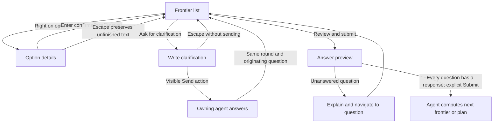
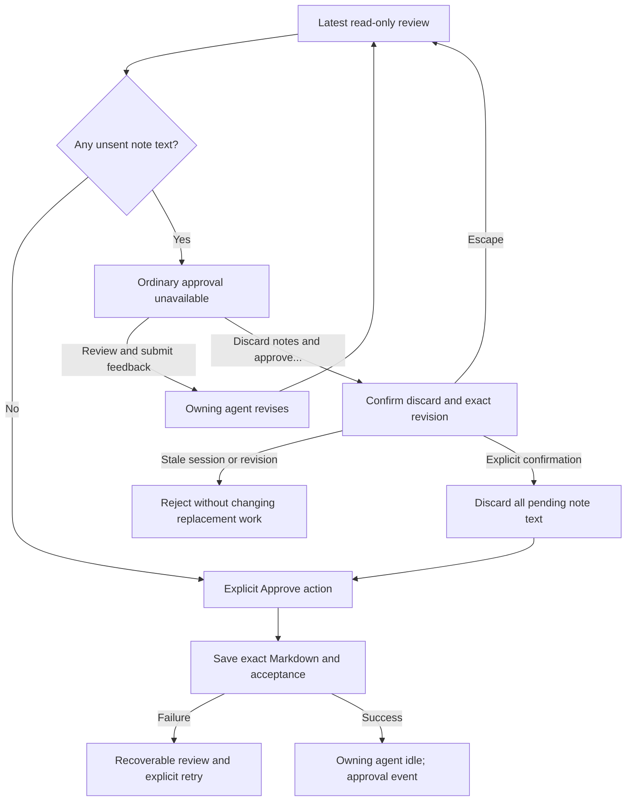

# Planning TUI interactions

These walkthroughs illustrate the required behavior in [SPEC.md](../SPEC.md).
Requirement IDs refer to that specification, which remains the contract.
The modal and annotation design awaits implementation; the [README](../README.md)
describes the available interface. Examples are illustrative, not a wire format.

## Frontier overview

The modal presents questions and options as one continuous list. A long frontier
scrolls, and each focused option retains visible question context. The marker for
keyboard focus differs from the marker for a confirmed answer.

```text
Question 3 · Primary navigation
  ○ Other (please specify)                    →
  ● Continuous option list with Tab shortcuts →
  ○ Switch questions with Tab                 →
    Ask for clarification…

Question 4 · Notes on unselected options
  ○ Other (please specify)                    →
› ○ Submit selected answer and details only   →
  ○ Include notes on every option             →
    Ask for clarification…

  Review and submit…
```

Here, `›` indicates focus and `●` indicates a confirmed selection. The exact
symbols and styling are implementation choices. A highlighted recommendation
does not count as an answer.

### Choose, qualify, and revise an answer

Requirements: REQ-007, REQ-016, REQ-030, REQ-031.

| Initial state                                     | User action                                                | Observable outcome                                                                                                     |
| ------------------------------------------------- | ---------------------------------------------------------- | ---------------------------------------------------------------------------------------------------------------------- |
| Question 3 is answered; question 4 is unanswered. | Move Down from the last action of question 3.              | Focus enters question 4; question 3's answer is unchanged.                                                             |
| Focus is on a generated option.                   | Press Right, enter details, and press Enter.               | That option is selected with confirmed details; focus returns to its row.                                              |
| An option has a confirmed answer and note.        | Open details, edit, and press Escape.                      | Unfinished text is preserved for reopening; the earlier confirmed answer and note remain the submitted candidate.      |
| An unselected option has draft notes.             | Select a different option.                                 | Both options retain their own text; only the selected option and its confirmed details enter the submission preview.   |
| Other is focused.                                 | Press Enter, leave its text blank, and attempt to confirm. | The field remains open with a validation message; no answer is selected.                                               |
| A generated option is selected.                   | Confirm nonblank text under Other.                         | Other replaces the selection; previous option notes remain local drafts.                                               |
| Focus is in the list.                             | Press Tab or Shift+Tab.                                    | Focus jumps to the adjacent question's selected or first option, wrapping at the ends. No answer changes.              |
| A later frontier introduces questions.            | Open that frontier.                                        | New numbers continue after earlier questions; an existing question retains its number after clarification or revision. |

Numbered answers can be composed in any order, as in a manual brainstorming
exchange: `3. A; 4. A — only send the selected option's details`. The outgoing
representation expands that shorthand into unambiguous context:

```text
Question 3 — Primary navigation
Selected: Continuous option list with Tab shortcuts

Question 4 — Notes on unselected options
Selected: Submit selected answer and details only
Details: Only send the selected option's details.
```

Stable plan/question/option identities accompany these display values. This
example does not require literal letter labels or a particular serialization.

### Clarification and whole-round submission

Requirements: REQ-005, REQ-007, REQ-012, REQ-016, REQ-028.



Clarification does not require a complete answer set. The request editor accepts
multiline text; Tab moves to Send, and Enter activates it. The modal returns
control to the owning agent and then reopens with the response associated with
the originating question and other drafts preserved.
The agent receives the request and any selected, confirmed answer context marked
as unsubmitted. Unselected option notes and unfinished editor text stay local;
the full drafts remain available when the modal reopens.

If a question remains blank, Review and submit explains what is missing and
offers Go to next unanswered question. A custom answer such as “Defer until we
choose deployment” counts as an explicit response, but does not resolve that
decision or authorize dependent choices. Sending a clarification or submitting
answers never means approving a plan.

## Read-only plan review

Requirements: REQ-016, REQ-022, REQ-032, REQ-033.

The document is read-only in every focus context. Request changes exposes overall
feedback; Add note opens a field beside or beneath the focused block. Paragraphs,
headings, list items, and code blocks can be targeted without substring selection.

```text
Plan review · Revision 4 of 4 · latest

  ## Completion behavior
› Print “Timer complete” and sound the terminal bell.
  Your note:
  Also display elapsed time; sound may be muted.

  ## Verification
  Test cancellation and normal completion.

  [Add note] [Request changes] [Review feedback] [Approve]
```

The action bar stays visible while document and note content scroll. Tab and
Shift+Tab transfer focus between the document, open note fields, and actions.
Arrows move within the active context: document navigation/scrolling, text cursor
movement, or action selection. Enter in a note inserts a newline; it cannot
insert text into the plan. Confirming a block note only stores local feedback.

### Annotate and submit feedback

| Initial state                                       | User action                                                                       | Observable outcome                                                                                        |
| --------------------------------------------------- | --------------------------------------------------------------------------------- | --------------------------------------------------------------------------------------------------------- |
| Latest revision is visible.                         | Focus a block and activate Add note.                                              | An inline note field opens with the original document still visible.                                      |
| Note field is focused.                              | Type paragraphs using Enter; then Tab to its confirmation action and activate it. | The note is associated with that exact block and revision and remains unsent.                             |
| Two paragraphs contain identical text.              | Annotate the second paragraph.                                                    | The annotation identifies that occurrence, not whichever text match is found first.                       |
| Confirmed block notes exist.                        | Add overall feedback and open Review feedback.                                    | The preview shows notes with their source excerpts and revision, plus overall feedback.                   |
| An editor contains unfinished, unconfirmed changes. | Open Review feedback.                                                             | The preview identifies the excluded unfinished edits; the user can return to confirm them before sending. |
| Outgoing feedback is nonempty.                      | Activate Submit feedback.                                                         | The owning agent receives the batch; reviewed Markdown remains unchanged.                                 |
| The agent returns a revised plan.                   | Review opens.                                                                     | The latest full revision appears without a diff or active annotations copied from the previous revision.  |

### Browse complete revisions

From document focus, `[` and `]` browse the available complete revisions. The
display identifies older revisions; annotation and approval are unavailable on
them. Returning to the latest restores its draft notes and reading position.
Inside a note field, typing brackets inserts those characters. Browsing never
changes which revision is pending approval or resends earlier feedback.

## Escape, approval, and recovery

Requirements: REQ-011, REQ-016, REQ-020, REQ-021, REQ-023, REQ-024, REQ-027.



The discard confirmation names the pending revision and includes block notes,
overall feedback, and unfinished note text. Cancelling the confirmation preserves
all notes. Confirming approves the unchanged plan; notes are not edits to apply
during saving. A failed save remains subject to the SPEC's explicit retry rules.

Escape returns from a field, preview, or confirmation without submitting. From the
outermost list or review, the first Escape shows “Press Esc again to close; drafts
will be kept.” A second consecutive Escape closes planning; any other input
dismisses the prompt. Returning from an editor does not count as the first outer
Escape. A newly opened modal starts without an armed closing prompt.

Closing stops the pending interaction, preserves saved unfinished work, and
requires explicit resume. It does not submit answers or feedback, approve a plan,
or trigger implementation. Storage failures remain visible; retained memory is
not presented as saved state. Session replacement invalidates old callbacks and
pending confirmations.

## Terminal and integration scenarios

Requirements: REQ-001, REQ-011, REQ-014, REQ-016, REQ-020, REQ-027, REQ-029.

| Situation                                             | Observable outcome                                                                                                            |
| ----------------------------------------------------- | ----------------------------------------------------------------------------------------------------------------------------- |
| Frontier or plan exceeds terminal height.             | Content scrolls; actions and the focused question/block remain reachable. Every line of a long block can be read.             |
| Terminal narrows or resizes while a note is open.     | Content adapts, actions remain visible, and focus, target identity, text, and confirmed selections survive.                   |
| Unicode, wide characters, or an input method is used. | Text is preserved, lines fit display width, and the active field receives cursor/input focus.                                 |
| SSH terminal cannot distinguish modified Enter.       | Plain Enter, Escape, arrows, and Tab still support the complete workflow.                                                     |
| Optional presenter returns input for an old revision. | Validation rejects it without changing current answers, note targets, or approval.                                            |
| An active presenter fails or unregisters.             | The TUI restores the pending interaction with drafts preserved. Cancellation closes without reopening.                        |
| Persistence fails or a session is restored.           | The UI reports the save state and restores only the applicable saved branch; it does not infer submission or replay approval. |

These scenarios define checks to perform during implementation. They are not
records of executed tests or proof that the current interface implements them.
