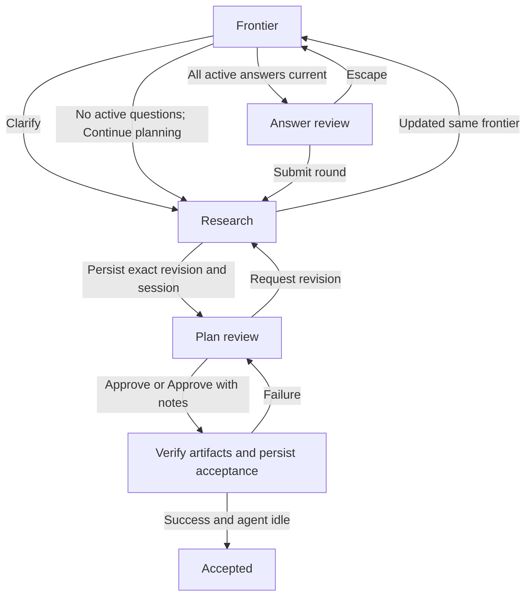
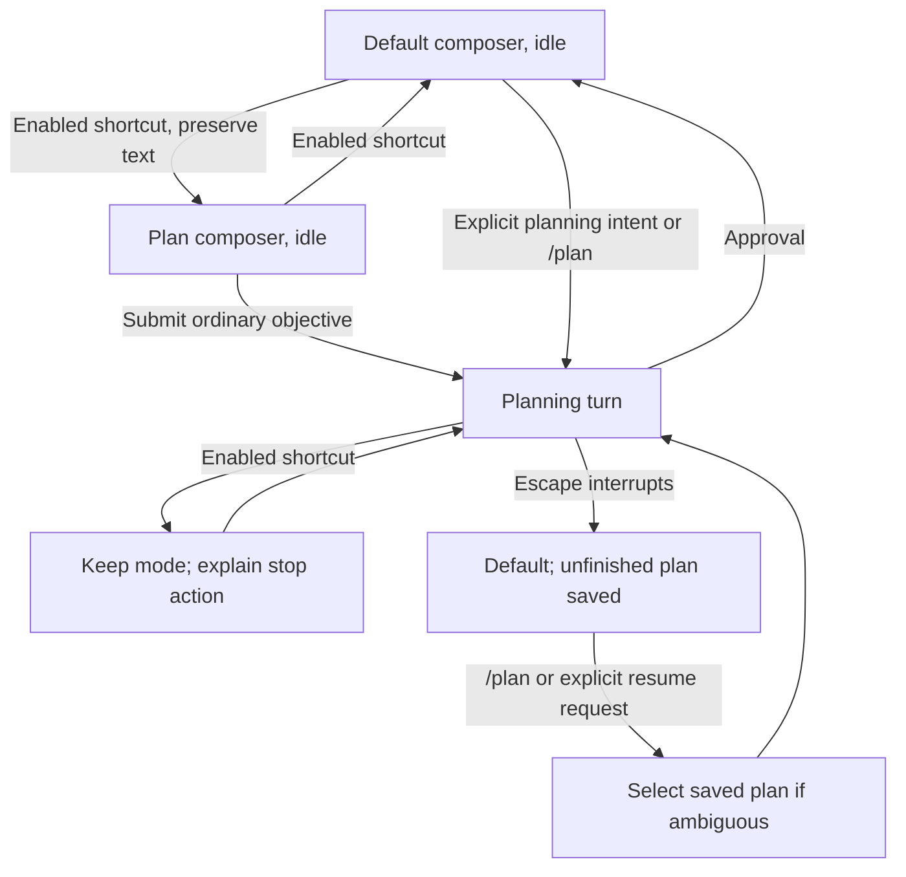

# Plan terminal interactions

This document is normative with [SPEC.md](../SPEC.md). Requirement identifiers name the shared
system contract. Examples illustrate the required interactions without defining a wire format.

## Modal layout

Requirements: REQ-terminal-interaction-boundary.

The modal uses the configured border and occupies 96% of terminal width. Title, action bar, and
optional hints remain fixed while content scrolls. A divider immediately follows the title, with a
blank row below it before content. The right-edge scrollbar identifies the content position.

Every submission action belongs to a call to action (CTA) bar below the content. A blank row
precedes its content divider; another follows that divider; a blank row follows the buttons. These
rows and the content divider do not depend on hints. When hints are enabled, a separate divider
follows the CTA padding and precedes at most one hint line. F1 toggles hints and their divider, not
CTA controls or errors. Each modal starts with the configured hints default. Short terminals omit
decorative padding, dividers, and hints before action controls or the last usable content row.

Enabled buttons use bracketed accent-colored labels. Focused enabled buttons use a contrasting
background, bold text, and `›`; disabled buttons use muted text. A focused disabled button retains
`›` and displays the reason it cannot activate. Focus styling applies even when only one button
exists. While an editor owns focus, buttons retain their unfocused appearance. Buttons wrap as
complete labels on narrow terminals; labels wider than the terminal wrap without losing text. Errors
remain above the buttons. Tab/Shift+Tab traverse individual buttons; Left/Right also move within the
bar. Enter activates only the focused control. Navigation never submits input.

An active agent waiting for a modal displays `Awaiting Plan` and a rotating working indicator.
Closing, failure, transfer, cancellation, and shutdown restore Pi's defaults. Cleanup from an older
modal cannot replace a newer wait indicator. Idle modal use does not create agent activity.

## Question frontier

Requirements: REQ-complete-frontier, REQ-explicit-round-submission, REQ-revision-validation,
REQ-same-agent-clarification, REQ-stable-question-numbers, REQ-option-details.

The title is `Plan questions (round N)`. Question numbers belong to logical decisions and never
change when questions move, change wording, or are reactivated. A distinct decision gets the next
unused number. Refining a decision preserves its number and increments its revision. Unaffected
answers and all drafts survive; a changed question displays `Please select again` and requires a
current selection. Earlier selections and question-version history are not displayed inline.

Questions show the current context, prompt, generated options, Other, and Ask for clarification. The
recommendation and reason follow the options. Option letters and labels are bold; selected options
have a selection marker distinct from keyboard focus. Generated-option notes follow the option in an
accent-colored `[notes: …]` suffix. Other text appears directly after its label in the theme's
Markdown code-block color; clarification text uses its link color. Neither has an answer/question
wrapper. Input and cursor positions wrap with the row.

Only the latest clarification exchange for a question is visible in the frontier. A blank row
separates it from the recommendation. The request label is `User question N: …`; N counts sent
requests for that question and survives revisions. A blank row precedes the response, whose lines
are indented two columns. Pending responses use `Awaiting response`. Older exchanges remain in
stored history and are available in answer review. Clarification can change alternatives,
recommendations, and the frontier's membership; it does not submit selections.

Withdrawn questions show only their original question heading struck through. Their old options,
answers, explanations, and clarification exchanges are not rendered. Deferred questions retain their
number and display a compact waiting heading; they do not require an answer until reactivated. The
agent must explain a withdrawal or deferral in its update, and stored drafts remain recoverable.

| Focus                               | Input                       | Result                                                                                                        |
| ----------------------------------- | --------------------------- | ------------------------------------------------------------------------------------------------------------- |
| Question list                       | Up/Down                     | Move across options and question boundaries without selecting.                                                |
| Question list                       | Tab/Shift+Tab               | Move between active questions and the CTA; preserve fields.                                                   |
| Generated option or Other           | Enter                       | Toggle an existing selection; otherwise select the option or nonblank Other draft. Empty Other opens editing. |
| Option, Other, or clarification row | Typing, paste, Backspace    | Start inline editing and apply the initiating input.                                                          |
| Inline field                        | Enter                       | Retain text and return to its row. Generated/Other fields select the answer; clarification remains unsent.    |
| Inline field                        | Shift+Enter                 | Insert a newline. Multiline paste remains available.                                                          |
| Inline field                        | Escape                      | Retain text and return to the row without arming outer closure.                                               |
| Empty inline field                  | Up/Down                     | Return to list navigation and move to the adjacent row.                                                       |
| Clarification row with text         | Enter on Send clarification | Send the request and close the modal for the owning agent's response.                                         |

Selecting another answer preserves unselected drafts. Clearing a selected answer preserves all text
and leaves the question unanswered. Unsent Other text, clarification text, and unselected option
notes remain local and never enter model-facing results.

The CTA is `Review answers and submit`. Until every active question has a current answer, it is
disabled; focus shows `Question N is not answered` or `Question N needs reconfirmation`. When every
question is withdrawn or deferred, the frontier shows `Continue planning`, which returns control
without creating decisions or approving a plan.

## Answer review

Requirements: REQ-explicit-round-submission, REQ-same-agent-clarification,
REQ-bounded-agent-results.

The review shows the current questions, selected answers, and selected notes. Sent clarification
history is collapsed by default and expandable per question. It contains the sent user questions,
agent responses, and historical question context. The submitted result includes this history
alongside decisions. Unsent drafts remain excluded.

The CTA contains only `Submit round`; Escape returns to the frontier. Tab/Shift+Tab traverse history
disclosures and the submit button. Enter expands a focused history or activates Submit round.
Scrolling retains the action bar and all draft data. Entering review and expanding history do not
submit. The package's normal bounded-result policy also applies to clarification history.

## Frontier history

Requirements: REQ-session-recovery, REQ-frontier-browsing.

F3/F4 browse previous/next logical frontiers within the plan. Each frontier has one browsing stop,
its latest completed snapshot; clarification updates do not create additional stops. Earlier
frontiers have an `earlier — read-only` title and disabled submission controls. They permit reading
and scrolling, but cannot edit answers, send clarification, or submit. Returning to the current
frontier restores its drafts, selection, focus, and reading position. Browsing does not restore
session-tree state or change the owning interaction identity. Snapshot history survives session
reload on the active branch.

## Plan review

Requirements: REQ-read-only-plan-review, REQ-plan-save, REQ-inline-block-annotations,
REQ-revision-browsing.

The title identifies the revision and renders its saved Markdown path as a clickable file link. The
path may be shortened for display; its link targets the absolute file URL. Unsupported terminals
retain readable path text. Before the modal opens, the immutable Markdown file and its recorded path
must be persisted. Failed persistence blocks display with retry/cancellation guidance.

The full Markdown remains read-only and scrollable. Blocks display source-line ranges in a gutter;
wrapping does not invent source line numbers. The selected block and its range are bold. Selection
is rendered in the document without a duplicated `Block N: excerpt` footer. Paragraphs, headings,
list items, code blocks, and other block structures retain their source identities, including
repeated and nested text. Markdown references, tables, lists, and code content remain intact.

Each nonblank annotation appears directly below its target block. Its gutter has no line number; an
upward arrow identifies the annotated source range, and a distinct theme background separates the
note from plan content. Nested notes are ordered by their source position and target range. Overall
feedback appears after the complete plan. Clearing a field removes its outgoing note. Notes remain
visible outside editing and are never inserted into the immutable plan file.

Up/Down select document blocks; PgUp/PgDn scroll. Typing, paste, or Backspace on a selected block
opens its note and applies the input. Enter opens an empty note; while editing, Enter retains text
and returns to document navigation, and Shift+Enter inserts a newline. Escape leaves editing with
text retained. F2 focuses overall feedback, which is also reachable at the document's end. Tab/
Shift+Tab leave fields and traverse content and individual CTA buttons. No Confirm note control or
separate feedback preview exists. Printable brackets enter note text like other characters.

Without nonblank notes the CTA is `Approve`. With notes it contains `Approve with notes` and
`Request revision`. Approve with notes accepts the displayed Markdown and supplementary notes;
Request revision submits the same current notes to the agent and awaits a newly reviewed plan.
Neither action interprets the note wording to choose the other outcome. Approval with notes saves a
companion Markdown file and includes structured notes and that file in the approval payload. The
plan artifact remains unchanged. Failed writes preserve drafts and require explicit retry.

F3/F4 browse earlier/later plan revisions. Earlier revisions are clearly read-only and cannot accept
notes, revision requests, or approval. Returning to the latest restores its notes and position.
Browsing cannot change the pending approval identity. New revisions do not inherit active notes from
their predecessors.

## Closing and recovery

Requirements: REQ-revision-validation, REQ-session-recovery, REQ-interaction-cancellation,
REQ-recoverable-failures.

Escape leaves an editor, disclosure view, or answer review without submitting. From the outermost
frontier or plan review, Escape arms closure; a consecutive Escape closes, stops the owning agent
turn, and returns to Default. Other input disarms closure. The optional reminder belongs to hints.
Closing plan review warns `Plan review closed without approval. Use /plan to resume.` Its expected
empty abort response does not display a model error. Other failures and interruptions remain
visible. Pending saves are flushed; persistence failures cannot be reported as saved drafts. Saved
work requires explicit resume. Late callbacks cannot modify a replacement session or revision.

## Interaction scenarios

| Scenario                                                       | Expected result                                                                                                                                                                  | Requirements                                                                                              |
| -------------------------------------------------------------- | -------------------------------------------------------------------------------------------------------------------------------------------------------------------------------- | --------------------------------------------------------------------------------------------------------- |
| Browse an earlier revision and return                          | Earlier revisions reject notes, revision requests, and approval. Returning to the latest restores its notes and reading position without changing the pending approval identity. | REQ-revision-browsing                                                                                     |
| Clarification revises options and withdraws a sibling question | Current choices require reconfirmation; the sibling retains only its struck heading; drafts and history survive.                                                                 | REQ-complete-frontier, REQ-revision-validation, REQ-same-agent-clarification, REQ-stable-question-numbers |
| All active questions are withdrawn                             | Continue planning returns an explicit empty-decision outcome after user activation.                                                                                              | REQ-explicit-round-submission                                                                             |
| Browse an earlier frontier and return                          | Historical input is rejected; current drafts, focus, and scroll remain intact.                                                                                                   | REQ-session-recovery, REQ-frontier-browsing                                                               |
| Expand history in answer review                                | Sent exchanges appear; submission includes them and excludes unsent drafts.                                                                                                      | REQ-same-agent-clarification, REQ-bounded-agent-results, REQ-option-details                               |
| Type notes on repeated or nested blocks                        | Each note remains bound to the selected source range through resize and appears beneath that target.                                                                             | REQ-terminal-interaction-boundary, REQ-inline-block-annotations                                           |
| Request revision                                               | All current nonblank notes are submitted once; the next revision requires fresh review.                                                                                          | REQ-read-only-plan-review, REQ-inline-block-annotations                                                   |
| Approve with supplementary notes                               | Both immutable artifacts and session acceptance are confirmed before the idle approval event.                                                                                    | REQ-session-recovery, REQ-plan-save, REQ-approval-event                                                   |
| File creation or session save fails before display             | Review does not open; exact content remains recoverable for retry.                                                                                                               | REQ-read-only-plan-review, REQ-recoverable-failures                                                       |
| Hide hints or shrink the terminal                              | CTA focus and activation remain available; decoration yields before controls.                                                                                                    | REQ-terminal-interaction-boundary                                                                         |

## Composer mode, entry, and settings

Requirements: REQ-planning-entry, REQ-configuration-precedence, REQ-session-recovery,
REQ-interaction-cancellation, REQ-composer-mode.

Before using the default Shift+Tab planning shortcut, rebind Pi's `app.thinking.cycle` in its agent
directory's `keybindings.json` and run `/reload`. The default path is
`~/.pi/agent/keybindings.json`; `PI_CODING_AGENT_DIR` changes the directory, and conflict warnings
name the actual path. Until the conflict clears, Shift+Tab retains its Pi action and Plan reports
the required correction. `/plan` remains available. In `/plan-settings`, choose another shortcut or
disable it. The menu shows any trusted project override and any host binding that blocks the
selected shortcut. After a successful save, shortcut changes apply immediately.

Selecting Plan alone does not send composer text or open a saved interaction. While work is running,
mode switching is rejected rather than deferred. Inside modals, Shift+Tab navigates their fields and
questions. Ordinary queued messages retain Pi's delivery policy and the running turn's mode. Default
conversation does not silently restart paused work. Native Escape can dismiss autocomplete without
interrupting the turn. After Pi finishes automatic recovery for an interrupted or failed planning
turn, Plan returns to Default.

Natural-language examples include “enter plan mode,” “help me plan this change,” “resume the plan,”
and “continue planning.” A feature question such as “what does plan mode do?” is not an entry
request. These are examples of intent, not keyword matching rules. The agent asks the user to select
a plan when a reference is ambiguous.

`/plan` restores the current unfinished plan or lists saved plans on this branch for selection.
`/plan-settings` selects personal defaults or trusted project overrides and shows the approved-plan
directory, symbols, border style, Show hints by default, and Planning shortcut. When a trusted
project value masks a personal setting, the personal menu names that value and its configuration
file. Updating appearance does not submit drafts. Unicode and Rounded are defaults; Double uses
double-line frames and dividers, ASCII uses ASCII frame characters and dividers, and None omits the
outer frame while retaining content and CTA dividers. Hints add a separate divider only when shown.
Pi's editor lines retain native styling. When a planning interaction next opens, it uses the updated
appearance settings and preserves its drafts. The settings menu displays each change immediately and
saves without progress or success messages. Key hints remain unchanged. A failed write restores the
previous setting and reports the error; Escape closes the menu.

Show hints by default uses the same personal/trusted-project precedence as the other settings. Set
it to Off and open a modal: hints and their divider are hidden, while errors and action controls
remain visible. Press F1 to show hints for that modal, then reopen it: the saved Off default applies
again. The first outer Escape arms closing even when the reminder is hidden.

| Scenario                                                                                       | Expected result                                                                                                                 | Requirements                 |
| ---------------------------------------------------------------------------------------------- | ------------------------------------------------------------------------------------------------------------------------------- | ---------------------------- |
| Switch composer modes while idle, then attempt a switch during work                            | Idle switching preserves typed text without sending input. During work, switching is rejected and does not queue a mode change. | REQ-composer-mode            |
| Update a personal setting with a trusted project override, then force a settings write failure | The menu identifies the overriding value and file. A failed write restores the previous displayed value and reports the error.  | REQ-configuration-precedence |

## Terminal and integration scenarios

Requirements: REQ-complete-terminal-package, REQ-revision-validation, REQ-exclusive-interaction,
REQ-terminal-interaction-boundary, REQ-session-recovery, REQ-recoverable-failures,
REQ-public-presentation-boundary.

| Situation                                                    | Observable outcome                                                                                                                      |
| ------------------------------------------------------------ | --------------------------------------------------------------------------------------------------------------------------------------- |
| Frontier or plan exceeds terminal height.                    | Content scrolls with a proportional right-edge scrollbar; title and footer stay fixed. Actions and every content line remain reachable. |
| Terminal narrows or resizes while a note is open.            | Content adapts, actions remain visible, and focus, target identity, text, and confirmed selections survive.                             |
| Unicode, wide characters, or an input method is used.        | Text is preserved, lines fit display width, and the active field receives cursor/input focus.                                           |
| Terminal cannot distinguish Shift+Enter.                     | Multiline paste supplies newlines in question and review-note fields; Enter retains text and leaves editing.                            |
| Optional presenter returns input for an old revision.        | Validation rejects it without changing current answers, note targets, or approval.                                                      |
| Terminal is selected or the presenter selector is cancelled. | The TUI reopens with drafts preserved and the saved hints default.                                                                      |
| An active presenter fails or unregisters.                    | The TUI restores the pending interaction with drafts preserved. Cancellation closes without reopening.                                  |
| Persistence fails or a session is restored.                  | The UI reports the save state and restores only the applicable saved branch; it does not infer submission or replay approval.           |

These scenarios define checks to perform during implementation. They are not records of executed
tests or proof that the current interface implements them.
