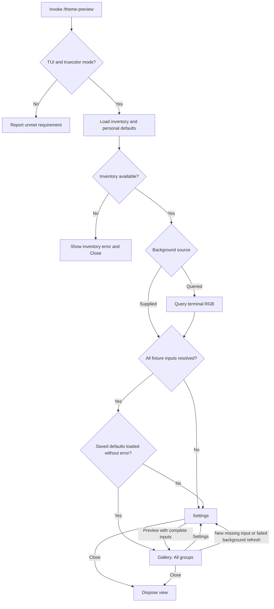
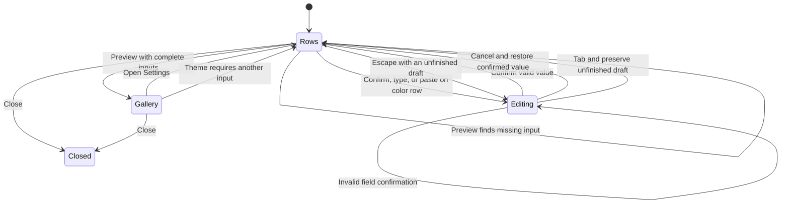

# Theme preview interactions

This document defines the terminal interaction contract for [@orbis/theme-preview](../SPEC.md). The
package view contains a settings page for terminal colors and a gallery page for static theme
fixtures. A fixture region is a labeled example that uses known theme tokens. The surface background
is the supplied or queried RGB color beneath fixture-specific backgrounds. All scenarios and control
tables are normative.

The view uses the active theme for its controls, labels, settings, and diagnostics. A low-contrast
theme may also make these elements hard to read; the package does not repair the theme or require a
separate diagnostic palette. Fixture measurements exclude these interface elements.

## Entry

Requirements: REQ-preview-entry, REQ-token-inventory, REQ-color-resolution, REQ-background-source,
REQ-personal-defaults, REQ-view-cleanup.

`/theme-preview` opens the fullscreen view without arguments. The package validates host mode and
color mode before displaying fixtures. It then reads saved defaults and the installed schema and, on
the queried path, starts the background query. Loading or query progress remains dismissible.

When the schema is available, saved defaults load without error, and all fixture inputs resolve, the
gallery opens with All selected and the document focused at its beginning. A saved-defaults
validation error opens settings even when the fixture colors already resolve; the error remains
visible until the author leaves settings or successfully saves replacement defaults. Otherwise, the
settings page explains what is missing and focuses the first missing input. When an error does not
require color input, focus starts on the background-source row. Inventory failure displays the error
and Close; color input cannot repair an unsupported schema.

| Initial state and action                                             | Observable result                                                                                     |
| -------------------------------------------------------------------- | ----------------------------------------------------------------------------------------------------- |
| Fresh invocation, successful query, and a theme with concrete colors | The gallery opens and identifies the queried background.                                              |
| Background query times out                                           | Settings explains the failure and exposes Retry query and Supplied color. Fixtures are not displayed. |
| A theme uses empty foreground and palette index 2 in several regions | Settings requires Terminal foreground and ANSI palette 2 and lists their dependent tokens.            |
| Invoke with arguments or from RPC/print/JSON mode                    | A usage or unsupported-mode message appears; a custom gallery does not open.                          |
| Close while a query is pending                                       | The view closes; the eventual answer does not reopen it.                                              |

## Settings

Requirements: REQ-color-resolution, REQ-background-source, REQ-personal-defaults, REQ-live-refresh.

Settings replaces the gallery page within the same fullscreen view. The header identifies Theme
preview and the active theme. The body contains input rows, dependent-token explanations, and inline
errors. The footer contains reachable actions. It states that Save defaults writes personal values
used across projects.

Inputs appear in the order below. Only palette indices needed by the current fixtures or already
present in the view's values require rows; all dependent tokens share the row for their index.

| Row or action       | Value or behavior                                                                                    |
| ------------------- | ---------------------------------------------------------------------------------------------------- |
| Background source   | Query terminal or Supplied color                                                                     |
| Background          | Editable `#RRGGBB` under Supplied color; read-only query result or query status under Query terminal |
| Terminal foreground | Editable `#RRGGBB`; required when a fixture uses an empty foreground                                 |
| ANSI palette index  | Editable `#RRGGBB`, ordered by numeric index 0-15, with dependent tokens and regions                 |
| Retry query         | Visible on the queried path; invalidates the previous query result and starts a bounded query        |
| Preview             | Validates every fixture input and opens the gallery only when all required colors resolve            |
| Save defaults       | Validates confirmed values and persists them without opening the gallery                             |
| Close               | Discards unsaved values and closes the package view                                                  |

A highlighted row is not an active text edit. Confirming a color row starts editing with its current
value. Typing or pasting on a color row also starts editing and inserts the initiating input. Pi's
single-line input component owns cursor movement, paste, and text editing. Unfinished text stays
attached to its input across resize and theme refresh.

Confirming a field validates and finishes that local edit; it does not preview or save. Invalid
input stays in the field with an inline error. Cancelling a field restores its previous confirmed
value and returns focus to the row. Tab does not confirm an unfinished field: it moves focus while
preserving the draft. Preview and Save defaults return focus to an unfinished field until the author
confirms or cancels it.

Confirming a background-source selection changes the source for the open view. The supplied color is
retained while querying and can be reused when the author selects Supplied color again. Switching to
Supplied color prevents a late query answer from replacing the supplied value. Switching to Query
terminal starts a fresh query.

Escape first cancels the focused edit or open selector without also leaving settings. When neither
is active and unfinished fields remain, Escape resumes editing the first unfinished field in row
order and preserves its draft. The author must confirm or cancel unfinished fields before Escape can
leave settings. With no unfinished fields, Escape returns to the gallery when current inputs are
complete, or closes the view when preview is blocked. The visible Close action remains available and
discards unsaved values. Cancelling a selector preserves its previously confirmed selection.

When required values are absent, Preview remains reachable and reports the missing inputs instead of
opening the gallery. Save defaults may retain an incomplete foreground or palette set, but it cannot
save malformed entries or Supplied color without a background. Until persistence succeeds, the view
does not display a saved confirmation. A failed save preserves edits and displays the error beside
the save status. Retrying does not require re-entering colors.

| Initial state and action                                                         | Observable result                                                                                                                                                                     |
| -------------------------------------------------------------------------------- | ------------------------------------------------------------------------------------------------------------------------------------------------------------------------------------- |
| Required foreground is missing; enter `#d4d4d4` and confirm the field            | Dependent tokens resolve locally; settings remains open and defaults remain unsaved.                                                                                                  |
| Enter an alpha color or malformed hex and confirm                                | The input remains editable with an error; Preview cannot use it.                                                                                                                      |
| Start editing a saved color, change it, then cancel the field                    | The previous confirmed color returns.                                                                                                                                                 |
| All confirmed colors resolve; edit a color, Tab away, then press Escape          | The field resumes editing with its draft intact; settings remains open. Confirm accepts the value; Escape cancels the edit and restores the confirmed value without leaving settings. |
| Required input is missing; leave an unfinished field with Tab, then press Escape | The first unfinished field in row order resumes editing with its draft intact; the view does not close.                                                                               |
| Finish an input, preview, close, and reopen without saving                       | The saved defaults return; the temporary input is discarded.                                                                                                                          |
| Save valid defaults, close, and invoke from another project                      | The saved inputs load; a queried source obtains a new terminal answer.                                                                                                                |
| Save fails                                                                       | The previous file remains intact, entered values remain visible, and the view does not display Saved.                                                                                 |
| A loaded store is malformed                                                      | Settings displays the load error. Temporary entries can enable preview; only an explicit Save defaults replaces the store.                                                            |
| A theme refresh requires an additional palette index                             | Settings focuses its missing row and preserves entered values and gallery position.                                                                                                   |

## Gallery

Requirements: REQ-active-theme, REQ-token-inventory, REQ-fixture-gallery, REQ-live-refresh,
REQ-view-cleanup.

The gallery is a continuous document whose sections use the fixture groups named in the SPEC. It
reflows to terminal width and scrolls within the available height. Its header and controls remain
visible while fixture content scrolls.

| Area          | Content                                                                              |
| ------------- | ------------------------------------------------------------------------------------ |
| Header        | Theme preview, active theme identity, background RGB and source                      |
| Coverage      | Global rendered, unresolved, and unrendered token status; names of unrendered tokens |
| Group control | All and the named fixture groups                                                     |
| Document      | Group headings, fixtures, token labels, and adjacent measurements                    |
| Footer        | Settings, Close, and hints for the actions available to the focused area             |

Focus cycles through the group control, document, and footer actions. Activating the group control
opens a selector. Moving the highlight does not apply a filter; confirming applies the selected
group and focuses its document at the beginning. Cancelling preserves the current group. Returning
to All restores every section. Filtering leaves global coverage and comparison calculations intact.

Opening Settings preserves the selected group and the visible fixture. Returning to the gallery
restores that context where it still exists. A changed theme refreshes colors and measurements
together. The gallery must not temporarily combine an old contrast number with a new fixture color.

| Initial state and action                                            | Observable result                                                                                     |
| ------------------------------------------------------------------- | ----------------------------------------------------------------------------------------------------- |
| All is selected; scroll across a group boundary                     | The next group's fixtures appear in the same document; header and controls remain available.          |
| Highlight Syntax in the group selector, then cancel                 | The original filter and document remain unchanged.                                                    |
| Confirm Syntax, then choose All                                     | Syntax appears alone, then the complete document returns. Global unrendered-token names stay visible. |
| Open Settings from a tool fixture, edit the background, and Preview | The gallery returns to that fixture with the new background and recomputed numbers.                   |
| A newly applied theme requires missing input                        | Fixtures are suspended and settings identifies the missing input.                                     |
| Close from the document                                             | Pi's session view returns without fixture messages, theme changes, or saved temporary inputs.         |

## Keyboard and focus

Requirements: REQ-fixture-gallery, REQ-color-resolution, REQ-personal-defaults, REQ-view-cleanup.

The following table describes default keys. Host action bindings are resolved through the injected
Pi keybindings manager; user overrides govern both input matching and displayed hints. Controls
remain reachable without modified Enter combinations. Input components preserve their normal editing
and copy bindings.

| Focus or context                                             | Host action                                      | Default key and result                                                                 |
| ------------------------------------------------------------ | ------------------------------------------------ | -------------------------------------------------------------------------------------- |
| Document                                                     | `tui.select.up`, `tui.select.down`               | Up/Down scroll one rendered line                                                       |
| Document                                                     | `tui.altScreen.pageUp`, `tui.altScreen.pageDown` | Page Up/Page Down scroll one viewport, clamped to document boundaries                  |
| Document                                                     | `tui.altScreen.top`, `tui.altScreen.bottom`      | Home/End reach the document boundaries                                                 |
| Settings rows or open selector                               | `tui.select.up`, `tui.select.down`               | Up/Down move between rows or choices                                                   |
| Settings rows or open selector                               | `tui.select.pageUp`, `tui.select.pageDown`       | Page Up/Page Down move through the visible list                                        |
| Control or selector                                          | `tui.select.confirm`                             | Enter activates the control or confirms the highlighted choice                         |
| Text field                                                   | `tui.input.submit`                               | Enter validates and finishes only that field                                           |
| Focus traversal                                              | `tui.input.tab`                                  | Tab advances between focus areas; within an edit, preserve its unfinished draft        |
| Active edit or selector                                      | `tui.select.cancel`                              | Escape cancels the local edit or selection                                             |
| Settings outside an edit or selector, with unfinished fields | `tui.select.cancel`                              | Escape resumes editing the first unfinished field in row order and preserves its draft |
| Settings without an edit, selector, or unfinished fields     | `tui.select.cancel`                              | Escape returns to an available gallery, or closes when preview is blocked              |
| Gallery outside a selector                                   | `tui.select.cancel`                              | Escape closes the view                                                                 |

Each focused action displays the key derived from its effective binding. A disabled binding is not
advertised as available. While a field is active, the input handler must not intercept printable
text as an action shortcut. When an input component has a selection, its copy operation must not
close the view. Session interruption follows the host lifecycle and disposes package resources.

Conformance includes rebinding a navigation action and a confirmation action: the new keys must
perform the actions and appear in the hints. Cancelling an edit must not close the outer view in the
same input event. Repeated traversal must reach every visible action and return to its starting area
without losing draft text.

## Measurements

Requirements: REQ-contrast-measurements, REQ-color-distinctness, REQ-vision-simulation.

Measurements appear beside or immediately below their fixture region. Every annotation names its
tokens and the foreground/background context or comparison partner. A background is identified by
its token or by Surface background. Text labels convey classification even when warning colors are
unreadable. The view does not require a separate diagnostic palette.

| Measurement or state                            | Required presentation                                                                           |
| ----------------------------------------------- | ----------------------------------------------------------------------------------------------- |
| Contrast                                        | Signed APCA Lc, WCAG ratio, foreground/background identification, and role threshold            |
| Magnitude below 15                              | Very low contrast                                                                               |
| Other magnitude below its role's warning cutoff | Low contrast                                                                                    |
| Distinctness below 2.3                          | Near-identical, ΔE2000, and both token names                                                    |
| Distinctness at least 2.3 and below 10          | Similar, ΔE2000, and both token names                                                           |
| General syntax or surface similarity            | Informational classification without a semantic-warning label                                   |
| Simulated semantic similarity                   | Semantic warning with deuteranopia, protanopia, or tritanopia named                             |
| Calculation failure                             | Unmeasured and a reason; do not substitute zero or a previous result                            |
| Measurement explanation                         | Advisory status, role targets, cutoffs, APCA calculation version, and selected simulation model |

The explanation is part of the scrollable document and remains reachable under group filtering.
Display rounding is an implementation choice; it must not conceal which side of a threshold an
actual result occupies. A boundary annotation or additional precision may explain a rounded value
that appears equal to its cutoff. An informational target shortfall does not use a warning label.

| Initial state and action                                | Observable result                                                                |
| ------------------------------------------------------- | -------------------------------------------------------------------------------- |
| Inspect light text on a dark background                 | Lc retains its negative sign; threshold classification uses its magnitude.       |
| Inspect a body-text pair with magnitude just below 60   | Low contrast appears with the role cutoff and secondary ratio.                   |
| Inspect a pair below 15                                 | Very low contrast replaces the ordinary contrast warning for that pair.          |
| Inspect equal syntax colors                             | Near-identical appears as information.                                           |
| Inspect equal semantic state colors                     | Near-identical appears as a semantic warning.                                    |
| A semantic pair becomes similar only under a simulation | Its diagnostic names the simulation; the fixture retains the unsimulated colors. |

## Terminal adaptation

Requirements: REQ-fixture-gallery, REQ-live-refresh, REQ-view-cleanup.

Every rendered line fits the terminal width according to Pi's display-width helper. Layout uses
ANSI-aware wrapping and clipping. Code and prose retain their content across wrapped lines; CJK,
combining characters, and emoji must not be split by JavaScript string length. Settings fields
preserve their cursor and input-method position through reflow.

| Terminal condition                                 | Required adaptation                                                                                                               |
| -------------------------------------------------- | --------------------------------------------------------------------------------------------------------------------------------- |
| Wide viewport                                      | Labels and diagnostics may appear beside fixture content when each remains readable within its allocated width                    |
| Narrow viewport                                    | Labels, fields, and diagnostics stack vertically; token names and input content remain reachable                                  |
| Height reduction                                   | Remove decorative spacing before controls; retain a scrollable content row whenever the viewport can contain controls and content |
| Viewport cannot contain controls and a content row | Display a compact resize message with a dismissal hint; preserve view state and resume when space returns                         |
| Resize while browsing                              | Reflow and anchor to the visible fixture where possible, otherwise clamp within the current group                                 |
| Resize while editing                               | Preserve the field, draft, cursor, and focus; scroll the focused input into view                                                  |
| SSH or multiplexer without an RGB query response   | Require supplied background input; do not infer RGB from environment hints                                                        |
| Theme or background refresh                        | Repaint the surface and fixture backgrounds, including blank rows and padding                                                     |

Conformance scenarios exercise a wide viewport, a narrow viewport, a height too small for the normal
layout, and restoration to the original size. Long fixture content remains reachable, the settings
and dismissal actions remain accessible, and scroll positions never exceed the reflowed document.
Resizing during a query or closing from the compact view must not apply stale asynchronous results.
